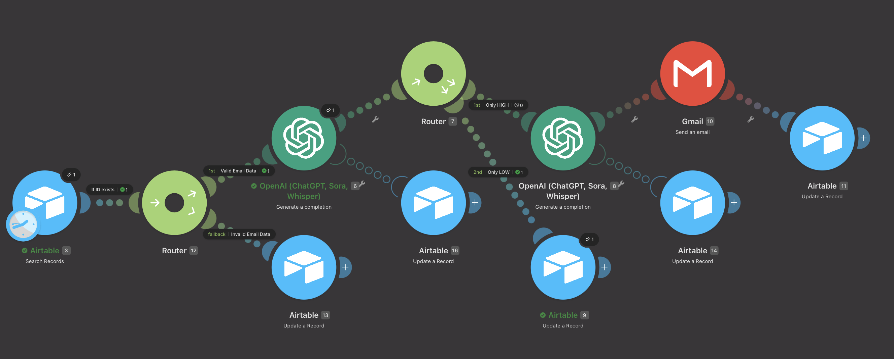

# AI-Powered HTML Email Notification Automation

An end-to-end automation workflow built with **Make.com**, **Airtable**, and **OpenAI**. It automatically transforms raw database records added to Airtable into beautifully formatted, responsive HTML emails generated dynamically by GPT models and delivers them to recipients.



---

## 🚀 Overview & Business Impact

This automation:
- Monitoring **Airtable** for new or updated records.
- Sending record metadata to **OpenAI API** with a strictly enforced HTML design system prompt.
- Dynamically generating responsive, beautifully styled HTML emails with proper typography, CTA buttons, and structured lists.
- Dispatching the email seamlessly to the intended recipient.

---

## 🛡️ Fault Tolerance & Resilience (Error Handling)
Unlike fragile basic automations, this pipeline incorporates enterprise error-handling strategies:
Pre-API Data Validation (Cost Saver):
Implements strict Regex email pattern matching (^[\w-\.]+@([\w-]+\.)+[\w-]{2,}$) and presence checks.
Invalid records route to a fallback path updating Airtable state to Error - Bad Data, preventing wasted OpenAI API credits.
API Exception Isolation:
Error Handlers attached to OpenAI modules trap timeouts or 5xx server errors.
Automatically flags failed records as Error - OpenAI in Airtable while keeping the pipeline active for subsequent jobs.
State Management:
Tracks explicit lifecycle states in Airtable via dedicated status fields (To Send ➔ Sent / Error - Bad Data / Error - OpenAI).

---

## 🛠️ Tech Stack

- **Workflow Automation:** [Make.com](https://www.make.com/)
- **Database:** [Airtable](https://airtable.com/)
- **AI / LLM Engine:** [OpenAI API](https://platform.openai.com/) (GPT-5o)
- **Email Service:** Gmail / SMTP Email Module via Make.com

---

## 📐 Architecture & Workflow

```text
                                  ┌───────────────────┐
                                  │   Invalid Data    │ ► Set status: Error - Bad Data
                                  └───────────────────┘
                                            ▲
                                            │ (Fallback)
┌──────────────┐      ┌──────────────┐   ┌──┴──┐      ┌──────────────┐      ┌──────────────┐      ┌──────────────┐
│   Airtable   │─────►│   Make.com   │──►│Router├────►│  OpenAI API  │─────►│ Email Module │─────►│ Update Base  │
│(Pending Data)│      │(Filter Match)│   └──┬──┘      │(HTML Prompt) │      │ (Send HTML)  │      │(Status: Sent)│
└──────────────┘      └──────────────┘      │         └──────┬───────┘      └──────────────┘      └──────────────┘
                                            │ (Valid Data)   │ (API Failure)
                                            ▼                ▼
                                   [Proceed to OpenAI]   ┌───────────────────┐
                                                         │ Set status: Error │
                                                         └───────────────────┘
```

1. **Trigger (Airtable):** Listens for new entries in a designated view/table.
2. **Processing (Make.com):** Extracts record details (Name, Description, Links, Recipient Email).
3. **Generation (OpenAI):** Calls OpenAI API with raw details and custom system instructions for inline-styled HTML generation.
4. **Delivery (Email):** Sends the clean HTML body via email action.

---

## 🤖 OpenAI System Prompt

The core magic lies in forcing the LLM to output pure, valid inline HTML without Markdown wrappers:

```text
You are an expert cold email copywriter specializing in personalized outreach. Your task is to generate a highly personalized, professional 3-sentence cold sales email body in HTML format.

**Input Variables:**
- {{3.`First Name`}} - The recipient's first name
- {{3.`Company Name`}} - The name of the recipient's company
- {{3.`Company Details`}} - Specific details about the company (industry, size, services, etc.)

**Requirements:**
1. Write exactly 3 sentences that are concise, direct, and professional in tone
2. Address the recipient by their first name in a natural way
3. Mention their company name and acknowledge what they do (using Company Details)
4. Clearly communicate how your solution can help them scale their company
5. Include a compelling call-to-action

**HTML Formatting Instructions:**
1. Use pure HTML with inline CSS only (no external stylesheets)
2. Font: Arial, sans-serif; neutral, subtle color scheme
3. Container: max-width 600px with 20px padding
4. Structure: short paragraphs with bold text for emphasis
5. Include a professional CTA button styled with:
   - Solid background color (e.g., #0066cc or similar professional blue)
   - White text color (#ffffff)
   - Padding and rounded corners for modern appearance
   - Link destination: https://github.com/biau95
6. Use clean spacing and readability best practices

**Output:**
Return ONLY the raw HTML code without any markdown formatting, code blocks, or explanatory text. The HTML should be production-ready and immediately usable for email sending.
```

---

## 📦 Repository Structure

```text
.
├── README.md               # Project documentation
├── blueprint.json          # Exported Make.com scenario blueprint
└── screenshots/                 # Screenshots & visual proof
    ├── scenario-make.png   # Make.com scenario visual
    ├── airtable-base.png   # Sample Airtable schema
```

---

## 🔧 How to Set Up

1. **Airtable Setup:**
   - Create a base with proper fields.
   - Create a view filtered for unprocessed records.

2. **Make.com Scenario Import:**
   - Clone this repository.
   - In Make.com, create a new scenario, click **... (More Options)** -> **Import Blueprint**.
   - Select `blueprint.json` from this repo.

3. **Connect API Credentials:**
   - Link your **Airtable** account.
   - Link your **OpenAI API Key**.
   - Configure your **Email / Gmail** module.

4. **Test & Activate:**
   - Run the scenario once with test data in Airtable.
   - Turn on the schedule for automated background runs.

---

## 👤 Author

Created for portfolio demonstration. Feel free to connect or adapt this workflow for your own projects!
